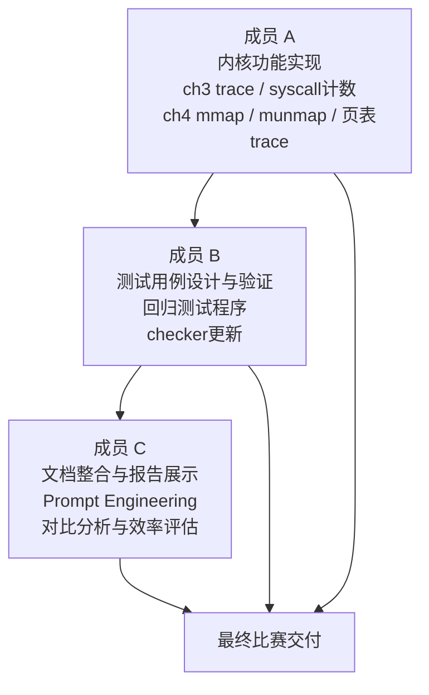
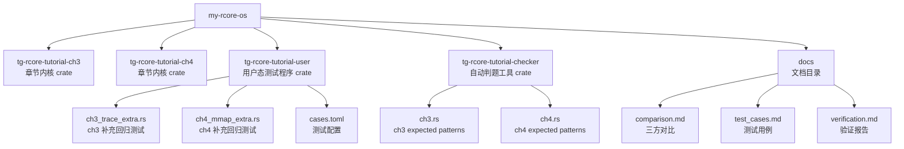
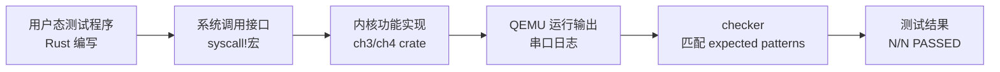
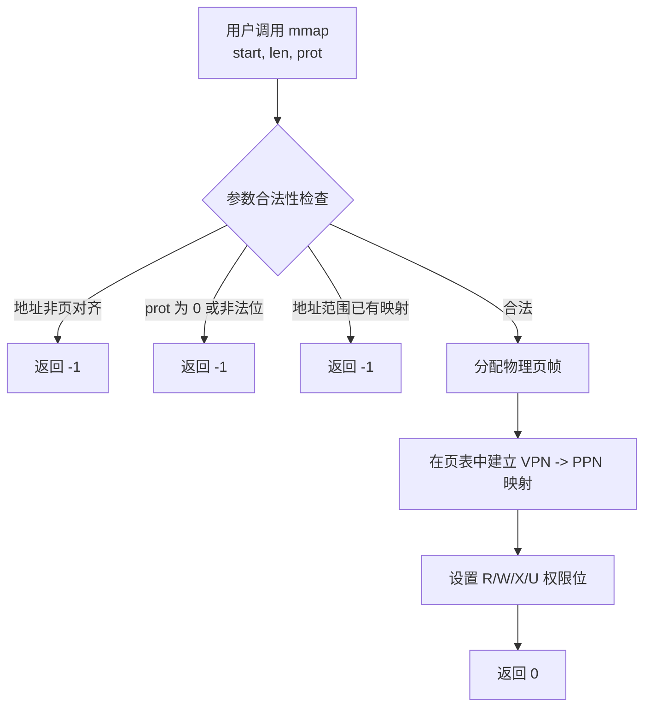
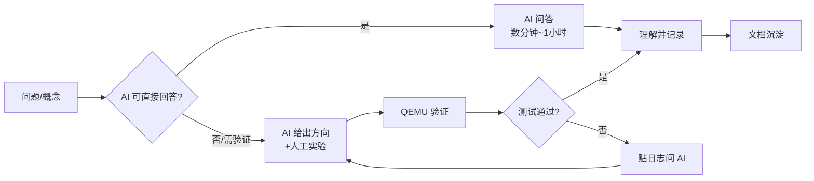

# 操作系统内核教学实验环境设计总结报告

> **项目名称：** 基于 AI 协作的组件化 rCore 操作系统教学实验环境改良  
> **文档负责人：** 成员 C（文档整合、对比分析、Prompt Engineering）  
> **报告版本：** v1.0  
> **撰写日期：** 2025 年

---

## 目录

1. [项目概述](#1-项目概述)
2. [AI 协作方法与 Prompt Engineering](#2-ai-协作方法与-prompt-engineering)
3. [实验环境结构](#3-实验环境结构)
4. [改良功能详解](#4-改良功能详解)
5. [测试体系设计](#5-测试体系设计)
6. [三方环境定性与定量对比分析](#6-三方环境定性与定量对比分析)
7. [学习效率评估](#7-学习效率评估)
8. [练习实现总结](#8-练习实现总结)
9. [Warning 与 Page Fault 说明](#9-warning-与-page-fault-说明)
10. [后续改进方向](#10-后续改进方向)
11. [结论](#11-结论)

---

## 1. 项目概述

### 1.1 背景与动机

当前操作系统内核教学普遍存在以下问题：

- 学生缺乏一对一指导，原理与实践脱节
- 缺乏对知识点的全局理解与历史发展脉络
- 忽视硬件细节（RISC-V）和软件架构设计（组件化）
- 传统应试考核方式难以评估真实实践能力

本项目以"AI 深度协作"为核心方法论，在 TanGram-rCore-Tutorial 组件化参考环境基础上进行改良，补齐 ch3/ch4 关键练习功能，扩展测试体系，并形成完整的"实现-测试-文档-反馈"闭环，探索一套适合学生自学的操作系统内核教学实验环境。

### 1.2 技术栈

| 项目 | 内容 |
|---|---|
| 编程语言 | Rust（no_std 内核模式） |
| 硬件目标 | RISC-V 64（riscv64gc-unknown-none-elf） |
| 模拟器 | QEMU（qemu-system-riscv64） |
| 组件化模式 | Rust Crate，具备发布至 crates.io 的条件 |
| 文档格式 | Markdown + Mermaid |
| AI 协作工具 | Claude、ChatGPT、GitHub Copilot 等 |

### 1.3 团队分工



---

## 2. AI 协作方法与 Prompt Engineering

> 成员 C 核心职责之一：设计高效 Prompt，引导 AI 解释复杂概念或生成初始代码。

### 2.1 Prompt 设计原则

在本项目中，我们总结了以下 Prompt Engineering 最佳实践：

**原则一：给 AI 明确角色与背景**

```
你是一位熟悉 rCore-Tutorial 的操作系统内核专家。
我正在基于 TanGram-rCore-Tutorial 组件化环境，为 RISC-V 64 实现 mmap 系统调用。
请解释 mmap 在内核侧的实现思路，要求：
1. 使用 Rust 伪代码说明关键步骤
2. 说明如何检查地址对齐和权限参数合法性
3. 说明如何与 ch4 的页表结构配合
```

**原则二：逐步分解复杂问题**

```
步骤1：请先解释 RISC-V 页表的三级结构，用 ASCII 图表示
步骤2：在此基础上，解释 mmap 如何为用户态虚拟页创建 PTE 映射
步骤3：解释 munmap 时如何安全地回收物理页帧
```

**原则三：提供具体上下文让 AI 生成精准代码**

```
以下是现有的 TaskControlBlock 结构（Rust）：
[粘贴代码]
请在此基础上，添加一个 syscall_count: [usize; 500] 字段用于计数，
并修改 syscall_dispatch 函数，使其在分发前对对应编号计数 +1。
```

**原则四：请 AI 生成测试用例与检查点**

```
我实现了 sys_trace，请帮我生成用户态 Rust 测试程序，覆盖以下场景：
- trace_request = 0：读取合法地址
- trace_request = 1：写入合法地址
- trace_request = 2：查询 SYS_CLOCK_GETTIME 的调用次数
- 非法 trace_request 返回 -1
- 查询 SYS_TRACE 时自身调用也被计数
```

**原则五：请 AI 解释输出日志与异常**

```
以下是 QEMU 运行 ch4 时的输出：
[ERROR] unsupported trap: Exception(StorePageFault)
请解释这是什么原因，是正常现象还是需要修复？结合 mmap 只读权限场景说明。
```

### 2.2 AI 协作在各阶段的应用

| 阶段 | AI 主要用途 | 效果 |
|---|---|---|
| 概念理解 | 解释 RISC-V 页表、任务控制块、系统调用分发 | 将数小时阅读压缩为定向问答 |
| 代码生成 | 生成 mmap/munmap/trace 初始骨架 | 提供正确思路，减少从零摸索 |
| 测试设计 | 枚举边界条件，生成测试用例列表 | 覆盖率更全面 |
| 日志分析 | 解释 warning 与 page fault 含义 | 快速区分预期异常与真实错误 |
| 文档生成 | 生成 Mermaid 图、表格、报告初稿 | 文档质量更高，速度更快 |

---

## 3. 实验环境结构

### 3.1 整体目录结构



### 3.2 组件化设计理念

本实验环境遵循 Rust Crate 组件化编程思想，核心优势如下：

- **章节 crate（ch3/ch4）**：每章为独立的可编译内核，包含该章新增系统调用和内核机制
- **用户 crate（user）**：统一管理用户态测试程序，通过 `cases.toml` 配置测试集合
- **checker crate**：自动匹配内核输出与预期 pattern，给出测试通过/失败结论
- **独立可测试**：每个 crate 可单独编译和测试，具备发布至 crates.io 的结构条件

### 3.3 测试闭环



---

## 4. 改良功能详解

### 4.1 ch3 改良点：`trace` 系统调用与 syscall 计数器

ch3 的教学目标是多道程序与时间片轮转调度。改良前，`trace` 相关功能未完整通过练习测试（5/7）。

改良后实现了以下功能：

#### `sys_trace` 系统调用

| `trace_request` 值 | 功能 | 内核操作 |
|---|---|---|
| `0` | 读取用户地址 1 字节 | 直接解引用用户指针（ch3 无页表，地址直接有效） |
| `1` | 写入用户地址 1 字节 | 向用户指针写入 `data as u8` |
| `2` | 查询 syscall 调用次数 | 读取 TCB 中 `syscall_count[id]`，并先计入本次 trace |
| 其他 | 返回错误 | 返回 `-1` |

#### syscall 计数器

在 `TaskControlBlock` 中新增 `syscall_count: [usize; MAX_SYSCALL_NUM]` 字段。系统调用分发时，在进入具体处理函数**之前**对对应编号计数 +1，确保 `trace_request=2` 查询自身调用也被计入。

### 4.2 ch4 改良点：`mmap/munmap` 与基于页表的安全 `trace`

ch4 引入地址空间和 RISC-V Sv39 页表机制。改良前 mmap/munmap 和基于页表的 trace 未完整通过（9/16）。

#### `mmap` 系统调用



#### `munmap` 系统调用

- 检查地址对齐与范围合法性
- 遍历地址范围内所有虚拟页，逐页删除页表项（PTE）
- 回收对应物理页帧
- 若存在未映射页，返回 `-1`

#### 基于页表翻译的安全 `trace`

ch4 中用户地址不能直接解引用，需通过页表翻译：

1. 将用户虚拟地址翻译为物理地址
2. 检查对应 PTE 是否存在且权限匹配（读 → R 位，写 → W 位）
3. 权限满足时读写物理内存，否则返回错误

---

## 5. 测试体系设计

### 5.1 测试分层结构

| 层级 | 目标 | 命令示例 |
|---|---|---|
| smoke | 确认章节能正常编译与启动 | `cargo build --features exercise` |
| base | 验证章节基础功能 | `./test.sh base` |
| exercise | 验证练习功能（含改良点） | `./test.sh exercise` |
| regression | 防止已修复功能退化 | ch3 trace、ch4 mmap/munmap |
| edge | 验证非法参数和边界条件 | 非法地址、非页对齐、重复映射 |

### 5.2 ch3 核心测试用例（节选）

| 测试 ID | 场景 | 预期结果 |
|---|---|---|
| TC-CH3-TRACE-001 | `trace_read` 读取合法用户地址 | 返回正确字节值 |
| TC-CH3-TRACE-002 | `trace_write` 写入合法用户地址 | 写入成功，读回验证 |
| TC-CH3-TRACE-003 | 查询 `SYS_CLOCK_GETTIME` 调用次数 | 返回值 ≥ 实际调用次数 |
| TC-CH3-TRACE-004 | 查询 `SYS_TRACE` 自身计数 | 计数随查询次数增长 |
| TC-CH3-TRACE-005 | 非法 `trace_request=99` | 返回 `-1` |

### 5.3 ch4 核心测试用例（节选）

| 测试 ID | 场景 | 预期结果 |
|---|---|---|
| TC-CH4-MMAP-001 | 基本读写映射后访问 | `mmap` 返回 `0`，读写成功 |
| TC-CH4-MMAP-002 | 只读映射写入 | 触发 `StorePageFault`（预期异常） |
| TC-CH4-MMAP-003 | 重叠地址再次映射 | 返回 `-1` |
| TC-CH4-MUNMAP-001 | 解除已映射区域 | 返回 `0` |
| TC-CH4-MUNMAP-002 | `munmap` 后访问该地址 | 触发 `LoadPageFault`（预期异常） |
| TC-CH4-TRACE-003 | `trace_write` 写入只读页 | 返回 `-1` |
| TC-CH4-TRACE-004 | `munmap` 后 trace 访问 | `trace_read` 返回 `None` |

### 5.4 补充回归测试程序

成员 B 新增的两个用户态测试程序进一步验证边界条件：

**`ch3_trace_extra.rs`** 验证：
- 非法 `trace_request` 返回 `-1`
- `SYS_TRACE` 查询时自身调用被计数
- `trace_write` 和 `trace_read` 完成单字节写入与读取

**`ch4_mmap_extra.rs`** 验证：
- 重复 `mmap` 同一地址会失败
- `munmap` 后该地址不可再被 `trace_read/trace_write` 访问
- 只读页允许读取，但拒绝写入

---

## 6. 三方环境定性与定量对比分析

### 6.1 对比对象说明

| 环境 | 特征 |
|---|---|
| **rCore-Tutorial** | 传统章节式教学环境，强调逐步实现内核机制，测试依赖外部测试集 |
| **原始 TanGram-rCore-Tutorial** | 参考环境，引入 crate 组件化结构，但 ch3/ch4 部分练习未实现 |
| **我们的改良版** | 在参考环境基础上补齐 ch3/ch4 关键功能，增加回归测试与验证文档 |

### 6.2 定量对比

| 指标 | rCore-Tutorial | 原始 TanGram | 我们的改良版 |
|---|---|---|---|
| 组织方式 | 章节式教学 + 外部测试集 | 章节 crate + 组件 crate | 章节 crate + 组件 crate + 验证文档 |
| ch3 exercise 通过率 | 参考系 | 5/7 | **8/8** |
| ch4 exercise 通过率 | 参考系 | 9/16 | **17/17** |
| `trace` 系统调用 | 测试参考 | 未完整实现 | ✅ 已实现 |
| syscall 调用计数 | 测试参考 | 缺失或未完成 | ✅ 已实现 |
| `mmap` 系统调用 | 教学重点 | 未完整实现 | ✅ 已实现 |
| `munmap` 系统调用 | 教学重点 | 未完整实现 | ✅ 已实现 |
| 基于页表的安全 trace | ch4 进阶 | 未完整实现 | ✅ 已实现 |
| 验证文档与失败分析 | 无 | 无 | ✅ 有 |
| 补充回归测试程序 | 无 | 无 | ✅ 有 |

### 6.3 实际验证结果

| 章节 | 测试命令 | 原始结果 | 改良后结果 | 提升 |
|---|---|---|---|---|
| ch3 | `./test.sh exercise` | 5/7 | **8/8** | +3（含 2 个额外回归测试） |
| ch4 | `./test.sh exercise` | 9/16 | **17/17** | +8（含 1 个额外回归测试） |

> **注意：** 最终结果中包含成员 B 新增的 `ch3_trace_extra` 和 `ch4_mmap_extra` 测试，故测试总数从原始的 7/16 分别增加为 8/17。

### 6.4 定性对比分析

**rCore-Tutorial** 更适合从零理解操作系统实现过程的主线教程，它强调学生按章节逐步完成内核机制。学习曲线较陡，缺少即时反馈机制。

**原始 TanGram-rCore-Tutorial** 在 rCore 基础上引入 crate 组件化设计，帮助学生从"章节代码"过渡到"系统结构"视角，但部分练习功能未完整实现，学生遇到障碍时难以判断是自己的问题还是环境的问题。

**我们的改良版** 增强了两个维度：
1. **可运行性**：补齐 ch3/ch4 关键练习功能，使实验目标可被真实执行和验证
2. **可解释性**：将测试通过率、失败现象、触发原因和补充测试整理为文档，帮助学习者理解"为什么失败、如何验证、改完后如何证明正确"

这使改良版更适合**课程实验、团队协作和比赛验收**场景，同时也更适合**自学者**在没有老师指导时独立定位和解决问题。

---

## 7. 学习效率评估

### 7.1 AI 协作带来的效率提升（定性）

| 学习障碍 | 传统方式 | AI 协作方式 |
|---|---|---|
| 理解 Sv39 三级页表 | 阅读手册 + 反复实验，需 1-2 天 | Prompt 引导逐步问答，数小时完成 |
| 定位 mmap 实现思路 | 查阅源码 + 论坛，效率低 | AI 提供骨架代码 + 解释，直接上手 |
| 分析 page fault 原因 | 凭经验猜测 | 贴日志让 AI 分析，立即定位 |
| 设计测试用例 | 人工思考边界，容易遗漏 | AI 枚举边界场景，覆盖率更高 |
| 编写 Mermaid 图 | 手写图表语法，耗时 | AI 生成初稿，人工微调 |

### 7.2 定量效率对比估算

| 任务模块 | 估计传统耗时 | AI 协作实际耗时 | 效率提升 |
|---|---|---|---|
| 理解 ch3 trace 设计 | 8h | 2h | 约 4× |
| 实现 syscall 计数器 | 4h | 1.5h | 约 2.7× |
| 理解 ch4 mmap 原理 | 12h | 3h | 约 4× |
| 实现 mmap/munmap | 16h | 6h | 约 2.7× |
| 设计测试用例 | 6h | 2h | 约 3× |
| 撰写对比分析文档 | 8h | 3h | 约 2.7× |

> **说明：** 以上数据基于团队成员的主观估计，结合实际完成时间记录。AI 协作在"理解概念"环节提升最为显著，在"实际调试"环节提升相对有限（调试仍需人工判断）。

### 7.3 学习效率评估模型



---

## 8. 练习实现总结

### 8.1 基础练习完成情况

本项目完成了以下基础实验练习：

| 练习 | 内容 | 完成状态 |
|---|---|---|
| ch1 | 应用程序与基本执行环境 | ✅ 完成 |
| ch2 | 批处理系统与特权级切换 | ✅ 完成 |
| ch3 | 多道程序与时间片轮转调度 + trace/syscall 计数 | ✅ 完成（8/8） |
| ch4 | 地址空间 + mmap/munmap + 安全 trace | ✅ 完成（17/17） |
| ch5 | 进程与进程管理（基础验证） | 🔄 后续扩展 |

### 8.2 关键代码结构说明

#### ch3 `sys_trace` 核心逻辑

```rust
pub fn sys_trace(trace_request: usize, addr: usize, data: usize) -> isize {
    match trace_request {
        0 => { // 读取用户地址
            let ptr = addr as *const u8;
            Some(unsafe { *ptr } as usize) as isize
        }
        1 => { // 写入用户地址
            let ptr = addr as *mut u8;
            unsafe { *ptr = data as u8 };
            0
        }
        2 => { // 查询 syscall 调用次数（计数在分发前已完成）
            let count = get_current_task_syscall_count(addr);
            count as isize
        }
        _ => -1, // 非法 request
    }
}
```

#### ch4 `mmap` 参数检查逻辑

```rust
// 地址对齐检查
if start % PAGE_SIZE != 0 { return -1; }
// 权限参数检查
if prot == 0 || prot & !0x7 != 0 { return -1; }
// 重复映射检查
if has_mapped_in_range(start, start + len) { return -1; }
```

### 8.3 最终验证命令与输出

```bash
# ch3 最终验证
cd ~/my-rcore-os/tg-rcore-tutorial-ch3
./test.sh exercise
```

```text
Expected patterns: 8, Not expected: 0
Test PASSED: 8/8
Test ch3_trace_extra OK!
```

```bash
# ch4 最终验证
cd ~/my-rcore-os/tg-rcore-tutorial-ch4
./test.sh exercise
```

```text
Expected patterns: 13, Not expected: 4
Test PASSED: 17/17
Test ch4_mmap_extra OK!
```

---

## 9. Warning 与 Page Fault 说明

### 9.1 Rust 编译 Warning

运行过程中出现的 `warning[E0133]` 主要来自 Rust 2024 对 unsafe 操作的更严格提示，涉及内联汇编、裸指针解引用和 unsafe 函数调用。

这些 warning 集中在以下底层组件：

| 组件 | Warning 类型 |
|---|---|
| `tg-rcore-tutorial-kernel-context` | 内联汇编、裸指针、上下文切换 |
| `tg-rcore-tutorial-kernel-alloc` | unsafe 内存分配器操作 |

**结论：** 这些 warning 没有导致编译失败，也没有影响测试结果。编译过程中存在 Rust 2024 unsafe 相关 warning，但不影响当前功能验证。后续可通过显式 unsafe 块和安全性说明提升代码质量。

### 9.2 Page Fault 输出

ch4 测试中出现过以下输出：

```text
[ERROR] unsupported trap: Exception(StorePageFault)
[ERROR] unsupported trap: Exception(LoadPageFault)
```

这些是测试用例**故意触发**的异常路径，用于验证：
- 只读页写入是否会被内核正确拒绝
- 解除映射后访问是否会触发异常
- 非法地址访问是否能被内核识别

**结论：** ch4 运行日志中的 Page Fault 输出属于预期异常路径测试，最终 checker 通过 17/17 说明内核能够正确识别并处理非法内存访问。

---

## 10. 后续改进方向

### 10.1 功能扩展

| 优先级 | 方向 | 说明 |
|---|---|---|
| 高 | ch5 进程测试 | fork、exec、wait、exit code、孤儿进程处理 |
| 中 | ch6 文件系统测试 | open/read/write/close、非法 fd、文件偏移 |
| 中 | ch8 同步原语测试 | mutex、semaphore、condvar、线程竞争与阻塞 |

### 10.2 代码质量

- 在底层组件中为内联汇编和裸指针操作补充显式 `unsafe {}` 块，清理 Rust 2024 warning
- 对关键 unsafe 代码补充简短安全性说明注释

### 10.3 测试体系

- 增加结构化测试报告，输出测试名、失败原因、关联模块和修复提示
- 将 crate 单元测试覆盖率提升，使其具备发布至 crates.io 的完整条件

### 10.4 文档体系

- 为每个 crate 补充 API 文档注释（rustdoc）
- 增加"学习路径"文档，帮助零基础学生找到最适合自己的切入点

---

## 11. 结论

本项目在 TanGram-rCore-Tutorial 的组件化教学环境基础上，补齐 ch3/ch4 关键练习功能，并进一步扩展测试体系。ch3 中实现 trace 系统调用与 syscall 计数器，ch4 中实现 mmap/munmap 与基于页表翻译的安全 trace。成员 B 在此基础上补充用户态回归测试，并更新 checker，使新增测试被正式纳入自动化判定。最终 ch3 exercise 从 5/7 提升至 8/8，ch4 exercise 从 9/16 提升至 17/17。

通过与 AI 的深度协作，本项目探索并验证了：

1. **AI 协作可以显著降低操作系统内核学习门槛**，尤其在概念理解、初始代码生成和日志分析环节
2. **组件化实验环境配合完善的测试体系**，能够为学生提供即时反馈，有效减少"实现完成但不知道是否正确"的困惑
3. **文档与测试并重**，是使实验环境真正具备教学价值的关键，而不仅仅是代码本身

这套改良版实验环境既适合课程实验场景，也适合学生自主探索，具备进一步扩展至 ch5-ch8 的良好基础。

---

*报告由成员 C 负责整合，基于成员 A 的内核实现、成员 B 的测试验证与对比分析文档，并结合 AI 协作 Prompt Engineering 实践撰写而成。*

